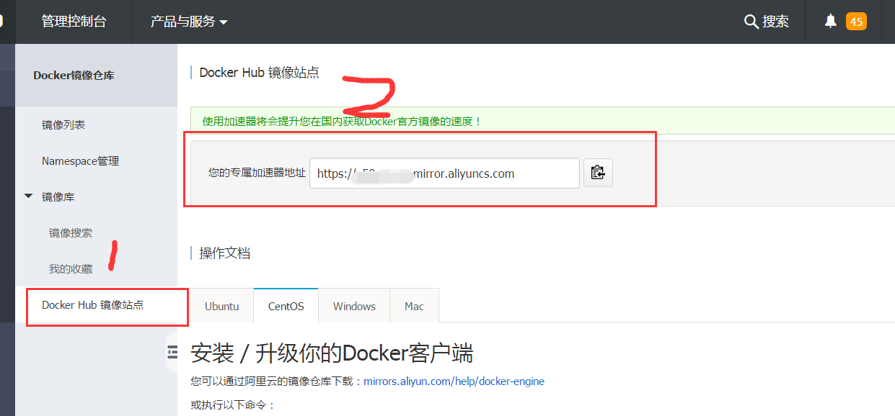

title: docker代理配置
date: 2017-06-16 13:39:00
tags:
  - linux
  - docker
---
## 目录

- [前言](#前言)
- [本地代理](#本地代理)
- [阿里云镜像加速](#阿里云镜像加速)
- [总结对比](#总结对比)

## 前言
在使用docker的时候，我们经常要使用docker.hub的镜像源来构建适合我们的docker镜像。但是因为伟大祖国的墙，导致下载镜像的速度非常慢甚至没有下载速度。下面介绍了几种解决docker镜像无法正常下载的方案。


## 本地代理
要使用本地代理，前提是你必须要有科学上网的手段。什么叫科学上网，请自行百度。因为这是程序员的必备技能之一，而且我认为这是程序员最重要的一个技能。我使用的是Shadowsocks。

### 修改Docker的systemd文件，添加http代理配置。
1. 修改/lib/systemd/system/docker.service
```
 EnvironmentFile=-/etc/sysconfig/docker
```
2. 创建或修改/etc/sysconfig/docker
```
HTTP_PROXY=http://proxy.example.com:1080/ #proxy.example.com换成自己的代理地址
HTTPS_PROXY=http://proxy.example.com:1080/  #proxy.example.com换成自己的代理地址
```
3. 刷新配置,使代理生效
```
systemctl daemon-reload
systemctl restart docker
```

## 阿里云镜像加速
ps:本人使用的centos系统，配置步骤仅供参考，其他系统请参照阿里云官方文档

### 获取专属加速器地址,访问[阿里云镜像服务](https://dev.aliyun.com/)



### 针对Docker客户端版本大于1.10的用户
您可以通过修改daemon配置文件/etc/docker/daemon.json来使用加速器：
```shell
sudo mkdir -p /etc/docker
sudo tee /etc/docker/daemon.json <<-'EOF'
{
  "registry-mirrors": ["https://y58m5c34.mirror.aliyuncs.com"]
}
EOF
sudo systemctl daemon-reload
sudo systemctl restart docker
```

### 针对Docker客户的版本小于等于1.10的用户
或者想配置启动参数，可以使用下面的命令将配置添加到docker daemon的启动参数中。
- 系统要求 CentOS 7 以上，Docker 1.9 以上。
```shell
sudo cp -n /lib/systemd/system/docker.service /etc/systemd/system/docker.service
```
- Docker 1.12 以下版本使用 docker daemon 命令
```
sudo sed -i "s|ExecStart=/usr/bin/docker daemon|ExecStart=/usr/bin/docker daemon --registry-mirror=https://qxx96o44.mirror.aliyuncs.com|g" /etc/systemd/system/docker.service
```
- Docker 1.12 及以上版本使用 dockerd 命令
```
sudo sed -i "s|ExecStart=/usr/bin/dockerd|ExecStart=/usr/bin/dockerd --registry-mirror=https://qxx96o44.mirror.aliyuncs.com|g" /etc/systemd/system/docker.service
sudo systemctl daemon-reload
sudo service docker restart
```

## 总结对比

对于一般的docker.hub的镜像而言，使用阿里云镜像加速的效果是非常明显的(不得不说下阿里云在这一块为我们IT行业的发展做出了不少的贡献)。但是使用过程中发现，许多其他的镜像源，比如kubernetes相关的基础镜像,阿里云并没有做到加速。所以当阿里云加速器不管用的时候，建议还是使用自己的科学上网工具吧。
